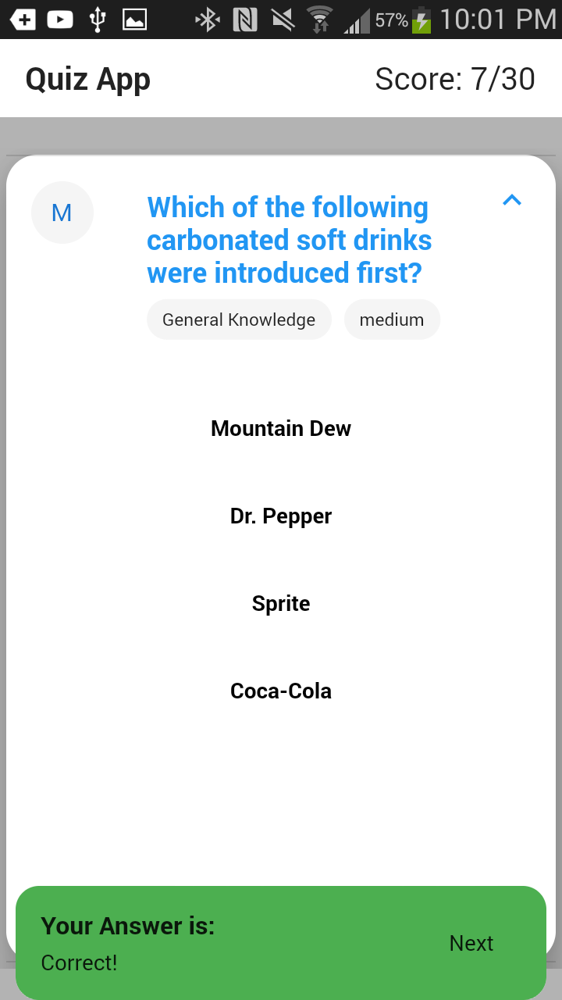

# flutter_quiz

This project is a simple quiz Flutter application.

## Dependencies used:

1. http

   - used for handling the http requests

2. fluttertoast

   - used for creating a Toast message

3. provider

   - for managing the state of the application

## Data source

- https://opentdb.com/api.php?amount=30

